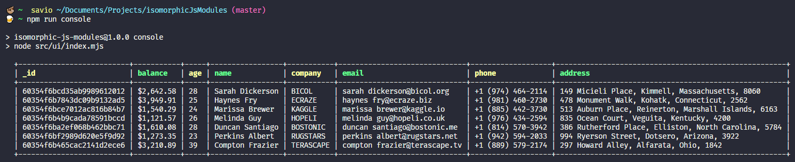
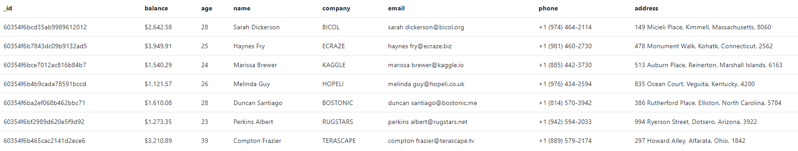

# 💻 Isomorphic JS

Project developed based on the "Live #2 - Aplicações multiplataforma usando apenas JavaScript" on [Erick Wendel](https://www.youtube.com/watch?v=vMnO-EOOfIU)'s youtube channel.

The main objective of this project is create an application that can be run in different environments rendering components according to the platform in context And also work with ECMAScript Modules to generate shared code and demonstrate the main challenges of this type of application


## Installation
```bash
npm i
```


## Run

```bash
npm run console
```


```bash
npm run web
```

This will create a localhost server on port 8080 with this content:



## Contributing
Pull requests are welcome. For major changes, please open an issue first to discuss what you would like to change.

Please make sure to update tests as appropriate.